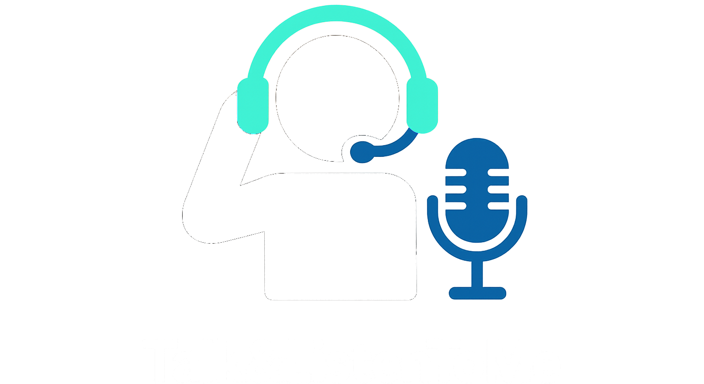
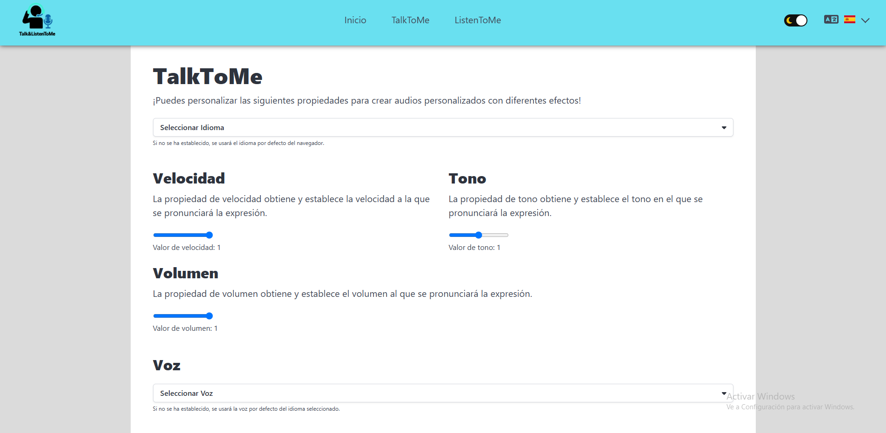
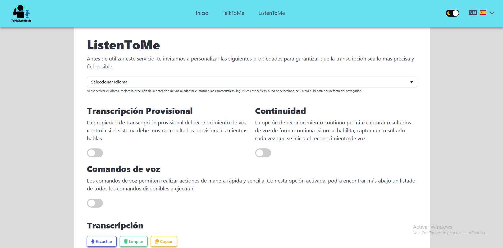

# 🎙️ Talk&ListenToMe

**Talk&ListenToMe** es una aplicación web interactiva que permite convertir texto a voz (Text-to-Speech) y transcribir voz en tiempo real (Speech Recognition), todo directamente en el navegador. Ideal para mejorar la accesibilidad, practicar idiomas o experimentar con control por voz.



---

## 🚀 Demo en vivo

🔗 [https://biel-taberner.github.io/TalkToMe](https://biel-taberner.github.io/TalkToMe)

---

## ✨ Funcionalidades

### 🔊 TalkToMe
- Convierte cualquier texto en voz.
- Soporte multilenguaje.
- Selección de voz por idioma.
- Configuración de velocidad y tono.

### 🎧 ListenToMe
- Transcribe en tiempo real lo que dices con el micrófono.
- Soporta comandos por voz personalizados.
- Modo continuo y modo con resultados provisionales.
- Copiar y limpiar la transcripción fácilmente.

---

## 🛠️ Tecnologías utilizadas

- ⚛️ React + TypeScript
- ⚡ Vite
- 🎨 Bulma + SASS
- 🌍 i18next (internacionalización)
- 🎬 GSAP (animaciones)
- 🎤 Web Speech API (SpeechRecognition + SpeechSynthesis)
- 🍪 react-cookie (persistencia de configuración)
- 🌐 GitHub Pages (despliegue)

---

## 🧠 Motivación

Este proyecto surge de la unión de dos ideas: una app para leer texto con voz (`TalkToMe`) y otra para transcribir tu voz (`ListenToMe`). La fusión de ambas permite demostrar cómo la web moderna puede servir como herramienta accesible, creativa y potente.

---

## 🖼️ Capturas

| TalkToMe |
|----------|
| 

| ListentoMe |
|----------|
|  |

---

## ⚙️ Instalación local

```bash
# Clona el repositorio
git clone https://github.com/Biel-Taberner/TalkToMe.git

cd TalkToMe

# Instala dependencias
npm install

# Ejecuta en modo desarrollo
npm start